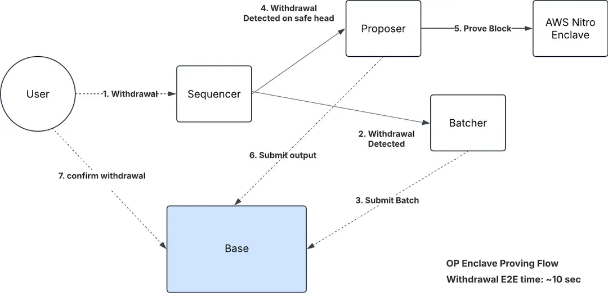

Horizen is an EVM L3 powered by op-enclave built on top of Base L2, which is one of the most high performant L2 in Ethereum ecosystem. OP-enclave is a modified version of the OP Stack that leverages Trusted Execution Environments (TEEs) for state transition proofs. This replaces the traditional optimistic rollup challenge period with a TEE-based trusted proof security model, enabling near-instant withdrawals.

## Proposer
The proposer used in Horizen is almost the same as OP Stack just with an addition to an AWS nitro TEE interface which runs the op-enclave. Proposer maintains the updated state and upon getting withdrwal requests ensures that the proof includes the new block before submitting a proposal to Base L2. It only proposes safe blocks, or if no withdrawals have occured it submits a proof every 15 minutes.

## Batcher
The batcher posts the transactions batches for deriving the Horizen L3 state. It is just slightly modified from the vanilla OP Stack implementation, where if a block contains a withdrawal event the batcher immediately treats the current channel as full and submits the batch to L2, this helps in prioritizing withdrawal transactions for rapid processing. Similat to the proposer, the batcher will also submit a batch every 15 minutes if no withdrawals events are triggered.

## Data Availability
Horizen leverages Amazon S3 to store batch data, with only an identifier to that data recorded onchain. As only a small identifier is stored onchain per batch, there is significant gas savings for end users. There is not much resilience on decentralized DA as the state is verified independently through the op-enclave.

## Understanding the workflow

- Users submits transactions to Horizen. The batcher collects these transactions and commits the identifier of the batch to Base L2 and the compressed transaction data is stored in Amazon S3.
- The proposer submits all the required information to op-enclave to execute the transactions statelessly. At the end of this execution you get the new Horizen state.
- After execution, op-enclave generates an attestation which includes all the required information along with Horizen's new output root and a signature from enclave's private key.
- The proposer receives the output root along with the attestation and then submits it to the OutputOracle contract on Base L2. The proposer only submits this data when a withdrawal occurs or 15 minutes passes.
- The OutputOracle contract checks if the signer is registered on the SystemConfigGlobal contract. If it is, the output root is accepted as this means it came from an attested AWS Nitro enclave running the correct code.
