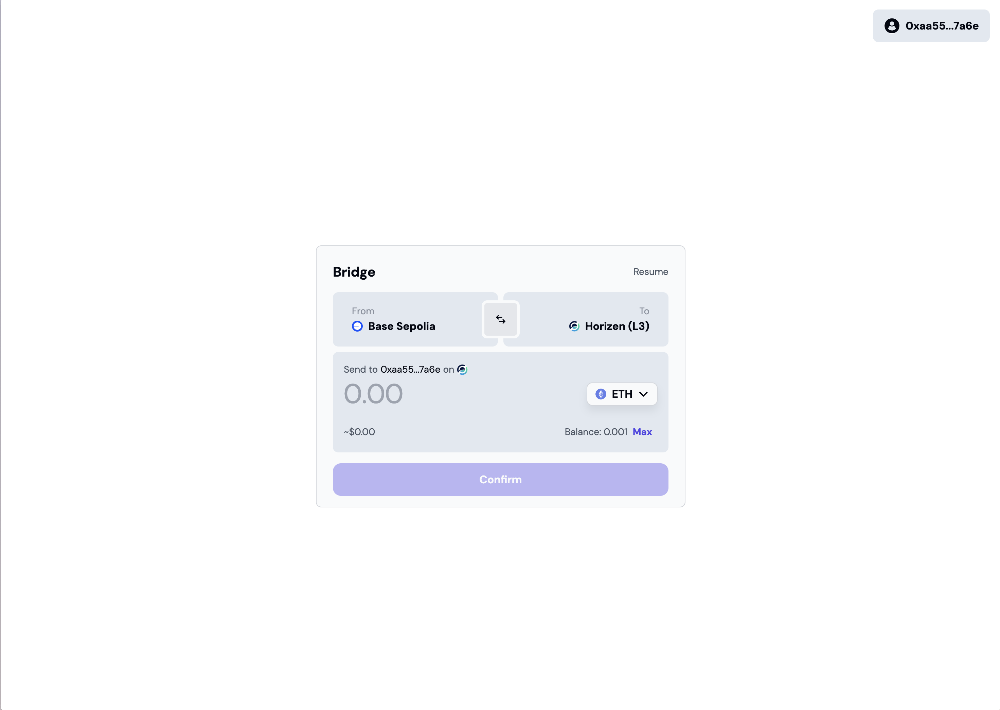
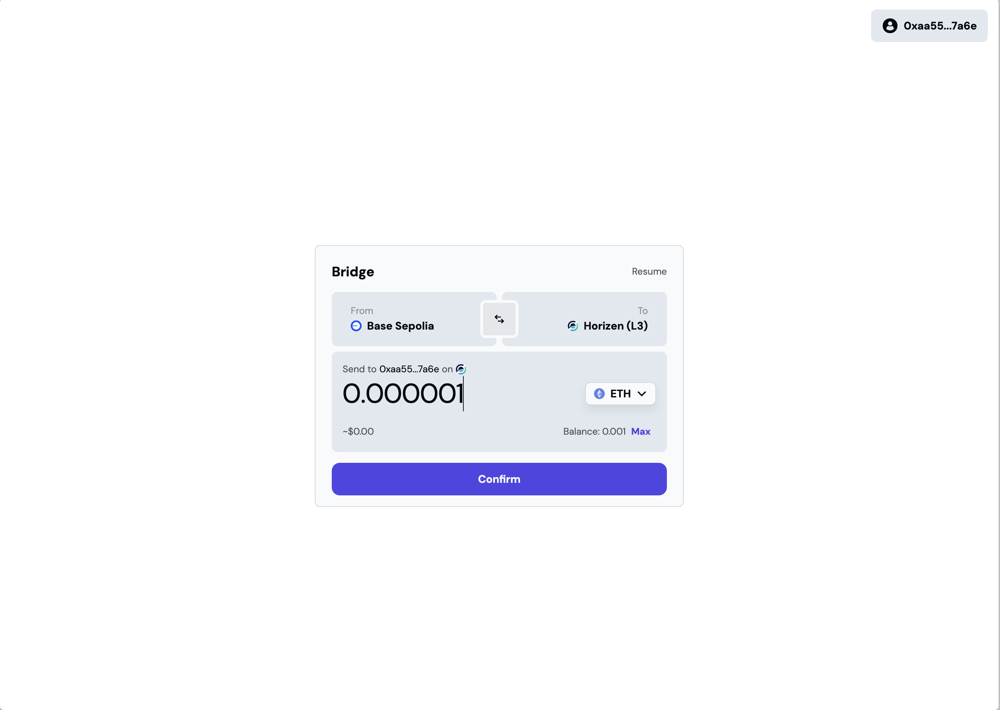
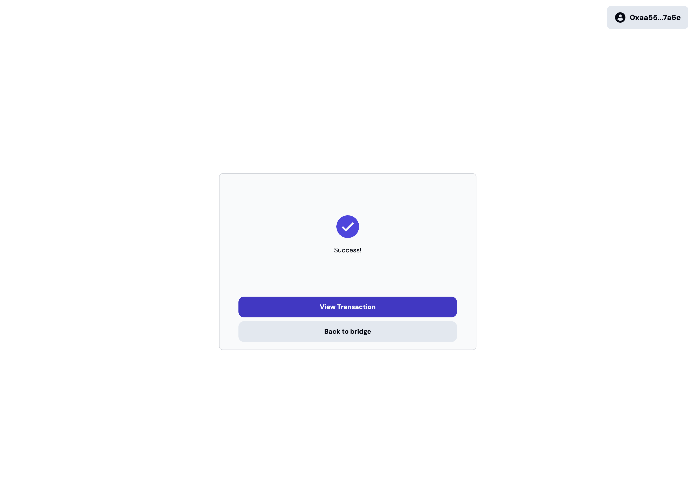
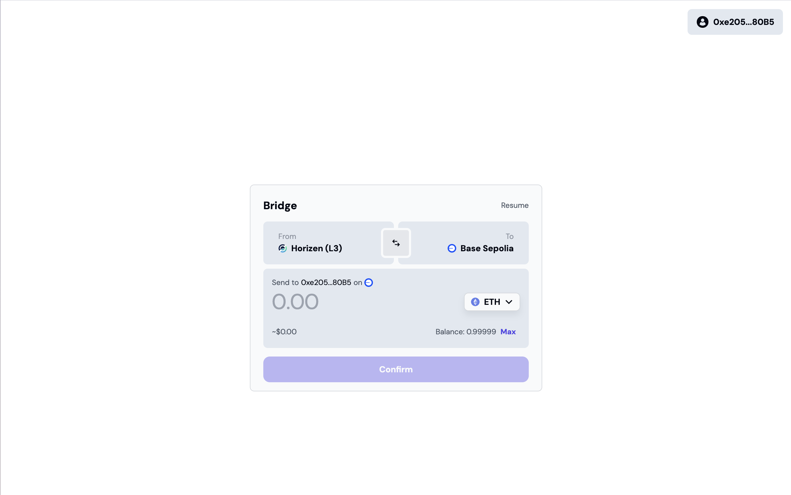
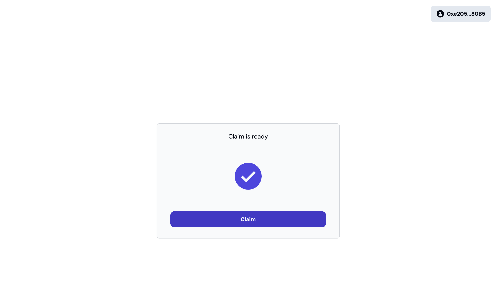

## Prerequisites
- A wallet with some ETH on Base Sepolia Testnet

Navigate to the native bridge deployed by the Horizen team:

| Chain                                                     | Link                                                                                                                                                                                                            |
| ----------------------------------------------------------- | ---------------------------------------------------------------------------------------------------------------------------------------------------------------------------------------------------------------- |
| Horizen Testnet | [Click Here](https://horizen-bridge.vercel.app/) |

## Bridging from Base to Horizen

Start by connecting your wallet, by clicking on ``Connect wallet`` button. Make sure that you have some ETH on your base sepolia account. Now you can see the following:

Make sure to choose ``Base Sepolia`` in the ``From`` field and ``Horizen`` in the ``To`` field. Next enter the amount of the ETH you want to bridge.

Next click on the confirm button and sign the required transaction from your base wallet.

You have succesfully bridged ETH from Base Sepolia to Horizen Testnet. You can check your address on our [Horizen Explorer](https://horizen-explorer-testnet.appchain.base.org/).

## Bridging ETH from Horizen to Base

Start by connecting your wallet, by clicking on ``Connect wallet`` button. Make sure that you have some ETH on your Horizen account. Make sure to choose ``Horizen`` in the ``From`` field and ``Base Sepolia`` in the ``To`` field. Next enter the amount of the ETH you want to bridge. Now you can see the following:

Sign the transaction, and you would see your claim is ready. Click on the claim button and sign the transaction on Base Sepolia.

You have succesfully bridged ETH from Base Sepolia to Horizen Testnet. You can check your address on [Base Sepolia Explorer](https://sepolia.basescan.org/).

